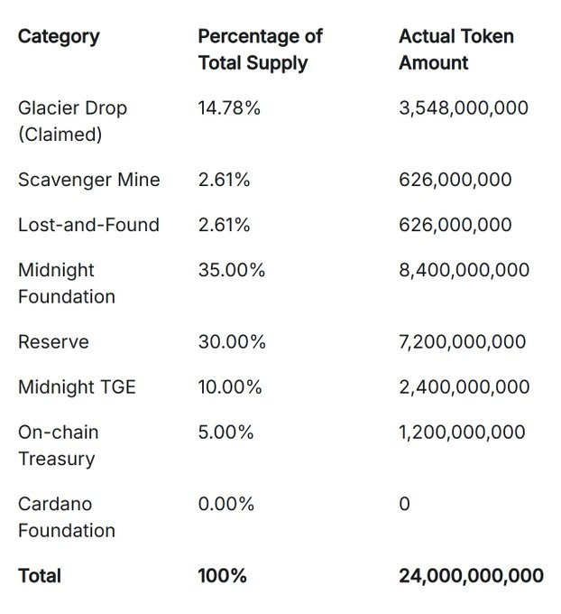

首先热烈祝贺: Cardano 主网已铸造 240 亿个 $NIGHT 代币, 这预示着午夜一个成功的起始点

- Glacier (冰川)空投 结束：Glacier空投 的当前领取阶段将于 2025 年 10 月 20 日 UTC 时间 13:00 结束。(如果你没有领,后续,还有机会可以领,但是不是全额), 钱包快照拍摄于2025年6月11日左右
- Scavenger(清道夫)挖矿 开放：** 在[清道夫挖矿](https://www.midnight.gd/news/digging-into-scavenger-mine-and-beyond)期间，任何人都可以完成拼图或计算游戏来获得 $NIGHT。
-  赎回阶段：在 Glacier Drop 和 Scavenger Mine 阶段完成后，将进行最终代币分配，然后用户将能够兑换他们的 $NIGHT 代币。

午夜代币分配在冰川空投阶段之后实施了两个附加阶段：清道夫挖矿阶段，然后是失物招领阶段。
## 清道夫挖矿简单介绍
在为期 30 天的“清道夫矿场”期间，任何人都可以通过完成计算任务或谜题来领取之前未被领取的 NIGHT 代币。未被领取的代币池将被分成 30 个等量的每日部分，每天一个，奖励在每个 24 小时时段结束时发放。

## 失物招领
在任何大规模的分发活动中，一些符合条件的参与者难免会错过最初的领取机会。“失物招领”阶段为那些未参加“冰川空投”阶段的参与者提供了一个机会。
主网上线后将有一小部分未领取的 NIGHT 代币可供领取。

## 清道夫挖矿如何参与
- 面向所有人
- 只需台式机或笔记本电脑上的网页浏览器以及网络连接即可,不支持智能手机
- 无需任何技术经验或生态系统背景
- 只要您的设备和浏览器处于活动状态，应用就会一直运行。为了最大限度地利用您的潜在资源，您可以每天 24 小时运行该实例。(30天)
- 准备一个没有使用过的空地址,链接官网
- 对唯一的声明消息进行签名

## 代币分配

参考链接:    
https://www.midnight.gd/news/night-token-supply-minted-on-cardano-mainnet
https://www.midnight.gd/news/digging-into-scavenger-mine-and-beyond
https://claim.midnight.gd/
https://midnight.network/blog/state-of-the-network-october-2025
https://www.midnight.gd/news/scavenger-mine-will-open-to-all-soon?__hstc=158474597.92badb4b84c223504ebac449591b9cb9.1759311615012.1760788609539.1761280466121.13&__hssc=158474597.1.1761280466121&__hsfp=1240836238